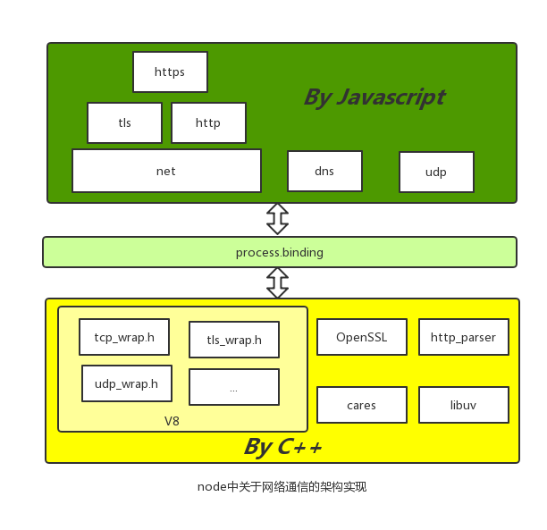

# 初步研究node中的网络通信模块
目前，我们处于互联网时代，互联网产品百花齐放。例如，当打开浏览器，可以看到各种信息，浏览器是如何跟服务器进行通信的？当打开微信跟朋友聊天时，你是如何跟朋友进行消息传递的？这些都得靠网络进程之间的通信，都得依赖于socket。那什么是socket？node中有哪些跟网络通信有关的模块？这些问题是本文研究的重点。

## Socket

Socket源于Unix，而Unix的基本哲学是『一些皆文件』，都可以用『打开open ==> 读/写(read/write) ==> 关闭(close)』模式来操作，Socket也可以采用这种方法进行理解。关于Socket，可以总结如下几点:

- 可以实现底层通信，几乎所有的应用层都是通过socket进行通信的，因此『一切且socket』
- 对TCP/IP协议进行封装，便于应用层协议调用，属于二者之间的中间抽象层
- 各个语言都与相关实现，例如C、C++、node
- TCP/IP协议族中，传输层存在两种通用协议: TCP、UDP，两种协议不同，因为不同参数的socket实现过程也不一样

## node中网络通信的架构实现

node中的模块，从两种语言实现角度来说，存在javscript、c++两部分，通过`process.binding`来建立关系。具体分析如下: 

- 标准的node模块有net、udp、dns、http、tls、https等
- V8是chrome的内核，提供了javascript解释运行功能，里面包含tcp_wrap.h、udp_wrap.h、tls_wrap.h等
- OpenSSL是基本的密码库，包括了MD5、SHA1、RSA等加密算法，构成了node标准模块中的`crypto`
- cares模块用于DNS的解析
- libuv实现了跨平台的异步编程
- http_parser用于http的解析

## net实用

## UDP使用

## DNS使用

## HTTP使用

## HTTPS使用

## 参考

[https://yjhjstz.gitbooks.io/deep-into-node/content/chapter9/chapter9-1.html](https://yjhjstz.gitbooks.io/deep-into-node/content/chapter9/chapter9-1.html)

