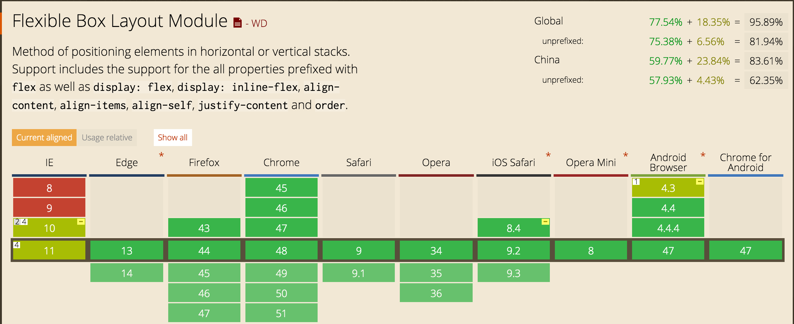

## bootstrap4源码阅读体会

bootstrap使用了很长时间，是页面快速开发的一把利器。最近，bootstrap4马上呼之欲出，春节闲来无事，就从源码层面解读下。

## 1. 移动优先

在移动互联网时代，很多公司都坚持移动端优先的原则，bootstrap也迎合了这种需求，具体表现在如下方面:

- 相对单位: `%`、`rem`的大量使用
- grid系统: 为了使用不同的设备，grid系统对xs、sm、md、lg、xl进行了响应式设计，通过media query做到适配
- 支持flexbox: mobile应该很快就可以使用flexbox

## 2. 代码结构

### 2.1 从less到saas

使用sass作为bootstrap的css预处理器，以前对预处理器不是很感冒，认为将简单问题复杂化了。但是通过阅读源码改变了这种认识:

- css模块化: css很简单、灵活，这是其优点，同时也是一个缺点。通过sass预处理器，可以根据功能将css模块化，便于css的管理
- 复用: 变量、mixin、function等技术，可以方便地进行代码复用
- 简洁: 支持each、if等语法，动态输出内容，例如繁琐的grid系统，是通过少量的sass代码做到的

### 2.2 代码结构

根据代码的层次，sass的源码分为如下几部分:

- 支撑部分: 包括[变量定义](https://github.com/twbs/bootstrap/blob/v4-dev/scss/_variables.scss)、大量的[mixin文件](https://github.com/twbs/bootstrap/blob/v4-dev/scss/_mixins.scss)，这是整个bootstrap的基础代码，也是进行个性化定制的其实位置
- 全局部分: [normalize.scss](https://github.com/twbs/bootstrap/blob/v4-dev/scss/_normalize.scss)用于覆盖各种浏览器的默认行为，保证起始样式的一致性
- 基础样式部分: 包含了reboot、typography、images、code、table、forms、buttons等，主要是一些常用的基础html元素
- grid部分: 选择性支持flexbox，默认情况下是关闭的，只要将`$enable-flex=true`就可以使用flexbox完成页面的栅格布局
- 组件部分: 包含大量常用的基础组件，有些需要添加jQuery plugin
- 工具类部分: 常用的简单样式，例如间距、文本对齐、字体加粗等

## 3. Grid

Grid用于页面的整体布局，同时css3也在起草[grid布局模块](https://drafts.csswg.org/css-grid/#grid-declaration0)。Grid也可以单独使用，bootstrap4提供了一个单独的文件([bootstrap-grid.scss](https://github.com/twbs/bootstrap/blob/v4-dev/scss/bootstrap-grid.scss))来实现栅格系统，具体来说Grid有如下特点:

- 默认情况下是12栅格
- 栅格可以嵌套使用
- 支持5种尺寸下的响应式样式
- 5个尺寸可以组合使用，适配不同终端下终端
- 支持使用flexbox

## 4. flexbox

flexbox目前还处于草案阶段，不过高级浏览器已经开始支持，如果只考虑高版本浏览器的话，可以启动通过`$enable-flex=true`来启动flexbox。

flexbox是未来布局的趋势，尤其是在复杂页面布局上，总得来说具有如下几个优点:

- 可伸缩性: 通过flex来实现空间的伸缩，在响应式设计中更加灵活(无需关注margin、padding、border等)
- 顺序定制: flexbox的一大亮点，通过order指定元素的显示顺序
- 轻松对齐: 通过`jsutify-content`、`align-items`可以方便实现元素的对齐
- 方向性: 通过flex-flow方便确定布局的方向

## 5. 组件设计

bootstrap里面提供了大量的常用组件，可以直接使用或者简单进行二次开发，加快日常业务的开发速度。同时，有些组件需要跟js(jQuery)配合，实现组件的交互效果。

里面的组件按是否需要js，可以分为两类:

- 无需js配合: Button系列、Form、Input系列、DropDown、Jumbotron、Label、Alert、Cards、Nav系列、Breadcrumb、Pagination、Progress、List
- 需js配合: Modal、Tooltips、Popovers、Carousels

需要注意的是Cards是bootstrap4新增的组件。

## 6. 参考

- [http://blog.getbootstrap.com/2015/08/19/bootstrap-4-alpha/](http://blog.getbootstrap.com/2015/08/19/bootstrap-4-alpha/)

