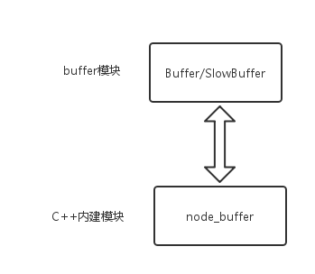
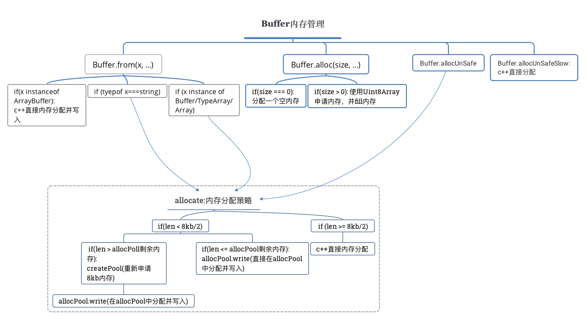

## Node源码解析 -- buffer

在Node、ES2015出现之前，前端工程师只需要进行一些简单的字符串或DOM操作就可以满足业务需要，所以对二进制数据是比较陌生。node出现以后，前端面对的技术场景发生了变化，可以深入到网络传输、文件操作、图片处理等领域，而这些操作都与二进制数据紧密相关。

Node里面的buffer，是一个二进制数据容器，数据结构类似与数组，数组里面的方法在buffer都存在(slice操作的结果不一样)。下面就从源码(v6.0版本)层面分析，揭开buffer操作的面纱。

## 1. buffer的基本使用

在Node 6.0以前，直接使用`new Buffer`，但是这种方式存在两个问题:

- 参数复杂: 内存分配，还是内存分配+内容写入，需要根据参数来确定
- 安全隐患: 分配到的内存可能还存储着旧数据，这样就存在安全隐患

```
// 本来只想申请一块内存，但是里面却存在旧数据
const buf1 = new Buffer(10) // <Buffer 90 09 70 6b bf 7f 00 00 50 3a>
// 不小心，旧数据就被读取出来了
buf1.toString()  // '�\tpk�\u0000\u0000P:'
```

为了解决上述问题，Buffer提供了`Buffer.from`、`Buffer.alloc`、`Buffer.allocUnsafe`、`Buffer.allocUnsafeSlow`四个方法来申请内存。

```
// 申请10个字节的内存
const buf2 = Buffer.alloc(10) // <Buffer 00 00 00 00 00 00 00 00 00 00>
// 默认情况下，用0进行填充
buf2.toString() //'\u0000\u0000\u0000\u0000\u0000\u0000\u0000\u0000\u0000\u0000'

// 上述操作就相当于
const buf1 = new Buffer(10);
buf.fill(0);
buf.toString(); // '\u0000\u0000\u0000\u0000\u0000\u0000\u0000\u0000\u0000\u0000'
```

## 2. buffer的结构

buffer是一个典型的javascript与c++结合的模块，其性能部分用c++实现，非性能部分用javascript来实现。



下面看看buffer模块的内部结构:

```
exports.Buffer = Buffer;
exports.SlowBuffer = SlowBuffer;
exports.INSPECT_MAX_BYTES = 50;
exports.kMaxLength = binding.kMaxLength;
```
buffer模块提供了4个接口:

- Buffer: 二进制数据容器类，node启动时默认加载
- SlowBuffer: 同样也是二进制数据容器类，不过直接进行内存申请
- INSPECT_MAX_BYTES: 限制`bufObject.inspect()`输出的长度
- kMaxLength: 一次性内存分配的上限，大小为(2^31 - 1)

其中，由于Buffer经常使用，所以node在启动的时候，就已经加载了Buffer，而其他三个，仍然需要使用`require('buffer').***`。

关于buffer的内存申请、填充、修改等涉及性能问题的操作，均通过c++里面的node_buffer.cc来实现:

```
// c++里面的node_buffer
namespace node {
  bool zero_fill_all_buffers = false;
  namespace Buffer {
    ...
  }
}
NODE_MODULE_CONTEXT_AWARE_BUILTIN(buffer, node::Buffer::Initialize)  
```

## 3. 内存分配的策略

Node中Buffer内存分配太过常见，从系统性能考虑出发，Buffer采用了如下的管理策略。



### 3.1 Buffer.from

`Buffer.from(value, ...)`用于申请内存，并将内容写入刚刚申请的内存中，value值是多样的，Buffer是如何处理的呢？让我们一起看看源码:

```
Buffer.from = function(value, encodingOrOffset, length) {
  if (typeof value === 'number')
    throw new TypeError('"value" argument must not be a number');

  if (value instanceof ArrayBuffer)
    return fromArrayBuffer(value, encodingOrOffset, length);

  if (typeof value === 'string')
    return fromString(value, encodingOrOffset);

  return fromObject(value);
};
```

value可以分成三类:

- ArrayBuffer的实例: ArrayBuffer是ES2015里面引入的，用于在浏览器端直接操作二进制数据，这样Node就与ES2015关联起来，同时，新创建的Buffer与ArrayBuffer内存是共享的
- string: 该方法实现了将字符串转变为Buffer
- Buffer/TypeArray/Array: 会进行值的copy

#### 3.1.1 ArrayBuffer的实例

Node v6与时俱进，将浏览器、node中对二进制数据的操作关联起来，同时二者会进行内存的共享。

```
var b = new ArrayBuffer(4);
var v1 = new Uint8Array(b);
var buf = Buffer.from(b)
console.log('first, typeArray: ', v1) // first, typeArray:  Uint8Array [ 0, 0, 0, 0 ]
console.log('first, Buffer: ', buf) // first, Buffer:  <Buffer 00 00 00 00>
v1[0] = 12
console.log('second, typeArray: ', v1) // second, typeArray:  Uint8Array [ 12, 0, 0, 0 ]
console.log('second, Buffer: ', buf) // second, Buffer:  <Buffer 0c 00 00 00>
```

在上述操作中，对ArrayBuffer的操作，引起Buffer值的修改，说明二者在内存上是同享的，再从源码层面了解下这个过程:

```
// buffer.js Buffer.from(arrayBuffer, ...)进入的分支:
function fromArrayBuffer(obj, byteOffset, length) {
  byteOffset >>>= 0;

  if (typeof length === 'undefined')
    return binding.createFromArrayBuffer(obj, byteOffset);

  length >>>= 0;
  return binding.createFromArrayBuffer(obj, byteOffset, length);
}
// c++ 模块中的node_buffer:
void CreateFromArrayBuffer(const FunctionCallbackInfo<Value>& args) {
  ...
  Local<ArrayBuffer> ab = args[0].As<ArrayBuffer>();
  ...
  Local<Uint8Array> ui = Uint8Array::New(ab, offset, max_length);
  ...
  args.GetReturnValue().Set(ui);
}
```

#### 3.1.2 string

可以实现字符串与Buffer之间的转换，同时考虑到操作的性能，采用了一些优化策略避免频繁进行内存分配:

```
function fromString(string, encoding) {
  ...
  var length = byteLength(string, encoding);
  if (length === 0)
    return Buffer.alloc(0);
  // 当字符所需要的字节数大于4KB时: 直接进行内存分配
  if (length >= (Buffer.poolSize >>> 1))
    return binding.createFromString(string, encoding);
  // 当字符所需字节数小于4KB: 借助allocPool先申请、后分配的策略
  if (length > (poolSize - poolOffset))
    createPool();
  var actual = allocPool.write(string, poolOffset, encoding);
  var b = allocPool.slice(poolOffset, poolOffset + actual);
  poolOffset += actual;
  alignPool();
  return b;
}
```

*a. 直接内存分配*

当字符串所需要的字节大于4KB时，如何还从8KB的buffer pool中进行申请，那么就可能存在内存浪费，例如:

> poolSize - poolOffset < 4KB: 这样就要重新申请一个8KB的pool，刚才那个pool剩余空间就会被浪费掉

看看c++是如何进行内存分配的:

```
// c++
void CreateFromString(const FunctionCallbackInfo<Value>& args) {
  ...
  Local<Object> buf;
  if (New(args.GetIsolate(), args[0].As<String>(), enc).ToLocal(&buf))
    args.GetReturnValue().Set(buf);
}
```

*b. 借助于pool管理*

用一个pool来管理频繁的行为，在计算机中是非常常见的行为，例如http模块中，关于tcp连接的建立，就设置了一个tcp pool。

```
function fromString(string, encoding) {
  ...
  // 当字符所需字节数小于4KB: 借助allocPool先申请、后分配的策略
  // pool的空间不够用，重新分配8kb的内存
  if (length > (poolSize - poolOffset))
    createPool();
  // 在buffer pool中进行分配
  var actual = allocPool.write(string, poolOffset, encoding);
  // 得到一个内存的视图view, 特殊说明: slice不进行copy，仅仅创建view
  var b = allocPool.slice(poolOffset, poolOffset + actual);
  poolOffset += actual;
  // 校验poolOffset是8的整数倍
  alignPool();
  return b;
}

// pool的申请
function createPool() {
  poolSize = Buffer.poolSize;
  allocPool = createBuffer(poolSize, true);
  poolOffset = 0;
}
// node加载的时候，就会创建第一个buffer pool
createPool();
// 校验poolOffset是8的整数倍
function alignPool() {
  // Ensure aligned slices
  if (poolOffset & 0x7) {
    poolOffset |= 0x7;
    poolOffset++;
  }
}
```

#### 3.1.3 Buffer/TypeArray/Array

可用从一个现有的Buffer、TypeArray或Array中创建Buffer，内存不会共享，仅仅进行值的copy。

```
var buf1 = new Buffer([1,2,3,4,5]);
var buf2 = new Buffer(buf1);
console.log(buf1); // <Buffer 01 02 03 04 05>
console.log(buf2); // <Buffer 01 02 03 04 05>
buf1[0] = 16
console.log(buf1); // <Buffer 10 02 03 04 05>
console.log(buf2); // <Buffer 01 02 03 04 05>
```

上述示例就证明了buf1、buf2没有进行内存的共享，仅仅是值的copy，再从源码层面进行分析:

```
function fromObject(obj) {
  // 当obj为Buffer时
  if (obj instanceof Buffer) {
    ...
    const b = allocate(obj.length);
    obj.copy(b, 0, 0, obj.length);
    return b;
  }
  // 当obj为TypeArray或Array时
  if (obj) {
    if (obj.buffer instanceof ArrayBuffer || 'length' in obj) {
      ...
      return fromArrayLike(obj);
    }
    if (obj.type === 'Buffer' && Array.isArray(obj.data)) {
      return fromArrayLike(obj.data);
    }
  }

  throw new TypeError(kFromErrorMsg);
}
// 数组或类数组，逐个进行值的copy
function fromArrayLike(obj) {
  const length = obj.length;
  const b = allocate(length);
  for (var i = 0; i < length; i++)
    b[i] = obj[i] & 255;
  return b;
}
```

### 3.2 Buffer.alloc

Buffer.alloc用于内存的分配，同时会对内存的旧数据进行覆盖，避免安全隐患的产生。

```
Buffer.alloc = function(size, fill, encoding) {
  ...
  if (size <= 0)
    return createBuffer(size);
  if (fill !== undefined) {
    ...
    return typeof encoding === 'string' ?
        createBuffer(size, true).fill(fill, encoding) :
        createBuffer(size, true).fill(fill);
  }
  return createBuffer(size);
};
function createBuffer(size, noZeroFill) {
  flags[kNoZeroFill] = noZeroFill ? 1 : 0;
  try {
    const ui8 = new Uint8Array(size);
    Object.setPrototypeOf(ui8, Buffer.prototype);
    return ui8;
  } finally {
    flags[kNoZeroFill] = 0;
  }
}
```
上述代码有几个需要注意的点:

#### 3.2.1 先申请后填充

alloc先通过`createBuffer`申请一块内存，然后再进行填充，保证申请的内存全部用`fill`进行填充。

```
var buf = Buffer.alloc(10, 11);
console.log(buf); // <Buffer 0b 0b 0b 0b 0b 0b 0b 0b 0b 0b>
```

#### 3.2.2 flags标示

`flags`用于标识默认的填充值是否为`0`，该值在javascript中设置，在c++中进行读取。

```
// js
const binding = process.binding('buffer');
const bindingObj = {};
...
binding.setupBufferJS(Buffer.prototype, bindingObj);
...
const flags = bindingObj.flags;
const kNoZeroFill = 0;

// c++
void SetupBufferJS(const FunctionCallbackInfo<Value>& args) {
  ...
  Local<Object> bObj = args[1].As<Object>();
  ...
  bObj->Set(String::NewFromUtf8(env->isolate(), "flags"),
    Uint32Array::New(array_buffer, 0, fields_count));
}
```

#### 3.2.3 Uint8Array

`Uint8Array`是ES2015 TypeArray中的一种，可以在浏览器中创建二进制数据，这样就把浏览器、Node连接起来。

### 3.3 Buffer.allocUnSafe

Buffer.allocUnSafe与Buffer.alloc的区别在于，前者是从采用`allocate`的策略，尝试从`buffer pool`中申请内存，而`buffer pool`是不会进行默认值填充的，所以这种行为是不安全的。

```
Buffer.allocUnsafe = function(size) {
  assertSize(size);
  return allocate(size);
};
```

### 3.4 Buffer.allocUnsafeSlow

```
Buffer.allocUnsafeSlow = function(size) {
  assertSize(size);
  return createBuffer(size, true);
};
```

Buffer.allocUnsafeSlow有两个大特点:

- 直接通过c++进行内存分配
- 不会进行旧值填充

## 4. 结语

字符串与Buffer之间存在较大的差距，同时二者又存在编码关系。通过Node，前端工程师已经深入到网络操作、文件操作等领域，对二进制数据的操作就显得非常重要，因此理解Buffer的诸多细节十分必要。
