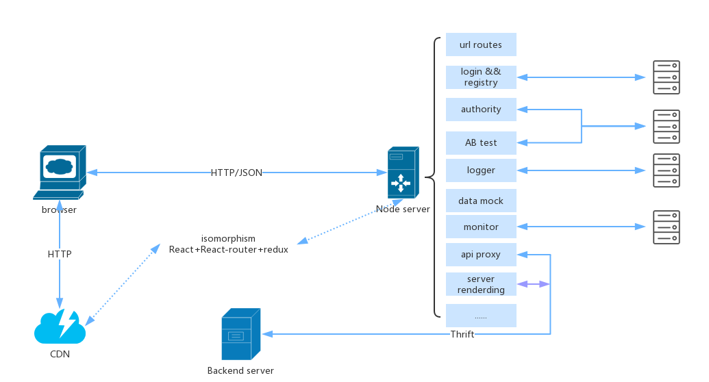

# 前后端分离实践及思考

从15年年底开始，团队开始实践基于node的前后端分离，在这一年多的时间里，不断尝试和摸索，积累了一些经验，同时仍然存在一些需要解决的问题，利用闲暇时间，总结下其中的思考。

## 1. 主体设计

前后端分离的架构主要分为四部分: 浏览器端、node server、CDN、Backend sever。整体的结构设计如下图:




下面针对几个问题，总结下实践经验。


## 2 前端资源

浏览器页面的资源主要分为两类: 动态html、静载资源，这两种资源来自于不同的服务。

### 2.1 资源的类型

####  动态html

用React实现同构应用，因此不需要前端模板，使用`ReactDOMServer.renderToString`得到html片段，然后再拼接成完成的html页面:

```
const store = redux.createStore(rootReducer, initialState, storeEnhancer);
return (`<!doctype html>
<html>
	<head>
		<title>${...}</title>
		<meta ...>
		<link href=${...} />
	</head>
	<body>
		<div>html fragment</div>
		<div id="${appName}">${ReactDOMServer.renderToString(ele)}</div>
		<div>...</div>
		<script>
			window.initState = ${JSON.stringify(store.getState())}
		</script>
		<script src="${...}"></script>
	</body>
</html>`);
```
有几点说明:

- html模板: 针对不同场景(pc、mobile、兼容IE8)，使用不同的html模板
- 初始数据: 需要将redux的初始化数据，作为html的一部分传递过来，只有这样才能保证前后端渲染的一致性(data-react-checksum计算结果一样)


#### 静态资源

静态资源包括: javascript、css、image、icon等，这些资源在部署的时候会同步到公司的CDN上，而上述html中的静态资源请求，也会到达CDN服务上。

### 2.2 资源的生产

使用babel && webpack 对javascript、css、image进行编译打包，实现从src(es6) --> lib(es5) --> dist(bundle.version.js)过程。

### 2.3 资源的部署

前后分离之后，前端就可以单独部署。因此，部署过程中，需要将一部分资源部署到node服务，另外一部分资源部署到cdn上。

## 3. 通信问题

### 3.1 浏览器层面

受限于浏览器本身，浏览器层面的通信很简单，依赖于HTTP协议进行数据的获取，而数据的格式则使用常见的JSON格式。

### 3.2 服务之间的通信

以前，服务之间的通信用到是HTTP协议，但是HTTP协议存在如下问题:

- HTTP协议是无状态协议，需要通过三次握手建立连接
- 传输效率也不高，存在较多冗余内容(大量header信息)
- 通信双方，对数据格式要求，不存在约束限制，数据同步是个大问题

基于以上原因，开始逐步使用Thrift框架来实现RPC(remote process call)，提高通信的效率，降低由于数据格式不一致造成的错误。

## 4. Node服务的功能

随着在业务中的不断尝试，node层的功能也越来越丰富，除了基本的url routes、数据mock、api proxy、server rendering外，团队已经将一些公共服务(例如登录注册、权限、ABtest、监控、日志收集)提取出来，作为基础服务进行维护。下面简单介绍几个功能:

### 4.1 数据momck


