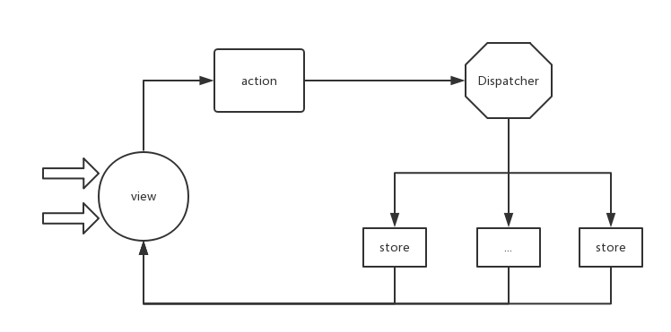
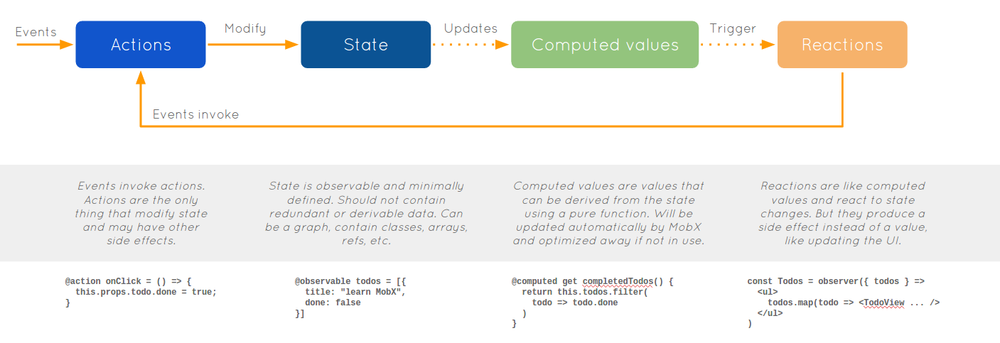

# flux vs redux vs mobx的对比

从react出现以后，关于state如何管理成为前端社区的热门话题，例如facebook最早提出的flux、Dan Abramov基于flux改进的redux、react conf2017大会上Preethi Kasireddy讲的mobx。这些state管理框架有如何使用、哪些特点以及它们之间有何异同，这是本文讨论的主要内容。

## 1. flux的基本介绍

flux是状态管理的一种设计模式，由facebook首先提出，用于解决react中的state管理问题。同时，facebook也有具体的实现，最初的`flux`模块仅仅提供了Dispatcher类，后面逐渐添加了一些其他辅助方法，但是不管如何，其核心还是Dispatcher。



下面是flux进行数据管理的基本实现:

```
var Dispatcher = require('flux').Dispatcher;
var dispathcer = new Dispatcher;

var store1 = {
  name: 'bj',
  changeName: function (text) {
    this.name = text;
  },
  getData: function() {
    return this.name
  },
};

var store2 = {
  count: 0,
  addOne: function () {
    this.count += 1;
  },
  getData: function () {
    return this.count;
  },
};

function handler1(action) {
  if (action.type === 'CHANGE_NAME') {
    store1.changeName(action.payload);
  }
}

function handler2(action) {
  if (action.type === 'ADD_ONE') {
    store2.addOne();
  }
}

dispathcer.register(handler1);
dispathcer.register(handler2);

dispathcer.dispatch({
  type: 'CHANGE_NAME',
  payload: 'mt && dp'
});

dispathcer.dispatch({
  type: 'CHANGE_NAME',
  payload: 'sh'
});
dispathcer.dispatch({
  type: 'ADD_ONE',
});

console.log(store1.getData());
console.log(store2.getData());
```

## 2. redux基本介绍

redux使用了flux的设计思想，同时结合函数式编程的模式，对状态进行管理的一个应用框架。简单来说: redux = flux + FP


用一个简单的demo介绍下redux是如何对状态进行管理的:

```
var redux = require('redux');
var reducer1 = function (state = {name: 'bj'}, action) {
  switch(action.type) {
    case 'CHANGE_NAME':
      return {
        name: action.payload
      };
    default:
      return state;
  }
}
var reducer2 = function (state = {count: 0}, action) {
  switch(action.type) {
    case 'ADD_ONE':
      return {
        count: state.count + 1,
      };
    default:
      return state;
  }
}
var rootReducer = redux.combineReducers({
  obj1: reducer1,
  obj2: reducer2,
})
var store = redux.createStore(rootReducer);
store.subscribe(function () {
  console.log('store is ', store.getState());
});
store.dispatch({
  type: 'CHANGE_NAME',
  payload: 'sh'
});
store.dispatch({
  type: 'ADD_ONE',
});
```

### redux的优点

- 单向流动: 具有更好的可预测性、可调式
- 不可变性: redux要求数据的不可变，这样便于回溯
- 可拓展性: 中间件机制，便于拓展、集成


## 3. mobx

mobx是一个简单、可拓展的状态管理库。内部抽象程度很好，所以开发的代码量很小，可以快速完成开发。



下面通过一个简单的实例说明mobx如果解决数据:

```
const mobx = require('mobx');
var todo = mobx.observable({
  list: [],
  get listLength() {
    return this.list.length;
  },
});

mobx.autorun(function () {
  console.log('todo number: ', todo.listLength);
});

var addItem = function(text) {
  todo.list.push(text)
}
// 或者
// var addItem = mobx.action(addItem);

addItem('beijing')
```

## 4. flux vs redux

- 相似点
  + redux = flux + fp，设计思想是一样的
  + 均保障了数据的单向流动
  + 要求state不可变
  + 采用事件机制的方式驱动state的变更

- 不同点
  + flux功能较简单，核心是实现了一个Dispatcher类，后来进行了重构，但是功能实现上比不上redux
  + flux里面可以存在多个store，但是redux只能由一个store
  + redux引入了函数式编程，在代码复用、单元测试上更有优势

## 5. mobx vs redux

- 相似点
  + 作用是一样的，均用于state的管理
  + 数据流动均是单向的

- 不同点
  + store：redux是单个store，mobx可以是多个
  + 数据结构：redux使用正常的javascript对象，而mobx进行包裹，得到observable数据
  + immutable：redux要求数据的不可变形，而mobx则不坐要求
  + action：redux通过action来驱动数据的变化，是必选项，而mobx则为可选项
  + 代码量：mobx代码量小，可以快速完成简单业务开发
  + 耦合性：redux耦合度低，可以便于复用，也方便进行单元测试
  + 生态环境：redux的生态环境优于mobx
  + 使用场景：mobx适用于简单的业务，快速完成开发；redux适用于复杂场景


## 参考

- [https://github.com/facebook/flux](https://github.com/facebook/flux)
- [https://mobx.js.org/](https://mobx.js.org/)
- [https://github.com/mobxjs/mobx](https://github.com/mobxjs/mobx)
- [https://zhuanlan.zhihu.com/p/25989654](https://zhuanlan.zhihu.com/p/25989654)

